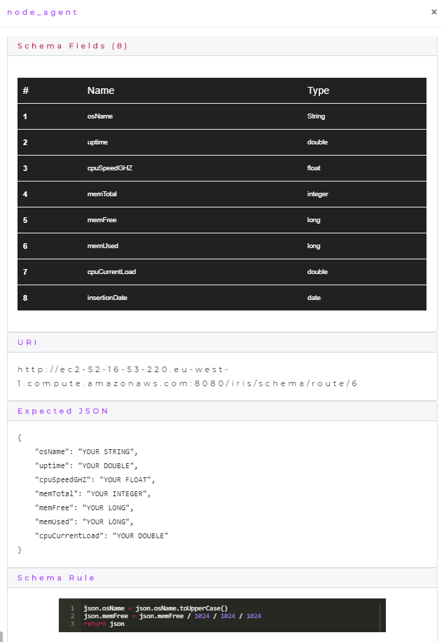
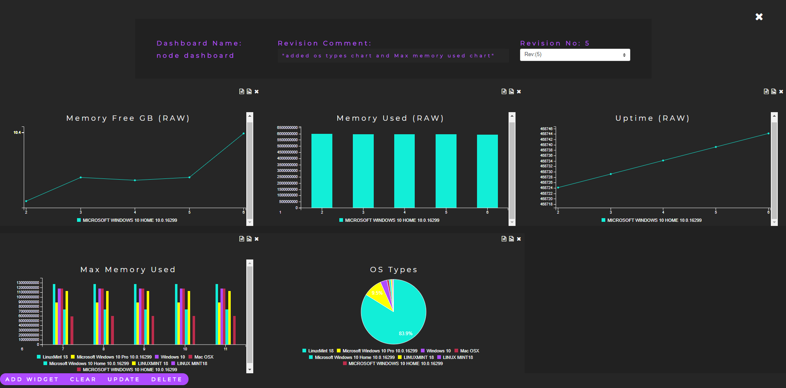
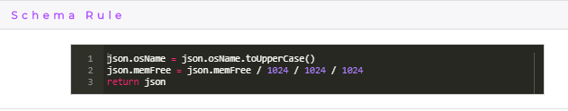

    

        
    

# Iris Node.js Agent

This repository contains the Node.js agent for my final year project [Iris](https://github.com/DeanGaffney/iris). This agent uses Node.js to periodically send OS (Operating System) information about the server to Iris to be monitored. The OS information is gathered using the [systeminformation](https://www.npmjs.com/package/systeminformation) package. This agent also demonstrates the use of [transformation rules](#agent-transformation-rule) in Iris which is discussed below in more detail.

## Agent Schema
The following is the schema that was created in Iris for the agent.

## Agent Dashboard
The following image shows the dashboard for the agent inside Iris where it is keeping track of the OS information on the server.

## Agent Transformation Rule
This Iris agent demonstrates the uses of transformation rules in Iris. Below is an image of the transformation rule which is written in Groovy and is associated with this agents schema.

 
The transformation rule is given access to the data pushed to Iris before it is sent out to dashboard charts, this allows a user to transform the data using a Groovy script which will be run over the data. In this example some of the system information gathered from the server is in bytes, the transformation script converts the bytes to gigabytes so that it can be displayed on the charts in gigabytes rather than bytes. This allows a user to write simple scripts to transform their data in real time and allows a user to avoid having to redeploy their application for small transformations as they can change the data in a central location with Iris.

## Other Iris agents
* [Selenium](https://github.com/DeanGaffney/iris-selenium)
* [MySQL](https://github.com/DeanGaffney/iris-mysql)
* [Android](https://github.com/DeanGaffney/iris-android)
* [Crypto Currency Rates](https://github.com/DeanGaffney/iris-crypto-rates)

## Built With

- Node.js

## Authors

* **Dean Gaffney**

See also the list of [contributors](https://github.com/DeanGaffney/iris-node/graphs/contributors) who participated in this project.